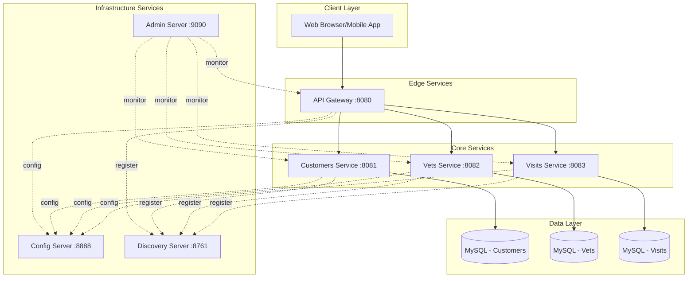

# Application Profile Generation Prompt Template

Use this prompt to generate a comprehensive **Application Profile** report that complements the aggregation assessment report with technical and architectural metadata.

---

## Prompt to Use:

```
Generate a comprehensive Application Profile report for the Spring PetClinic Microservices application. 
This should focus on technical metadata, architecture, and deployment information (NOT assessment findings). 

Analyze the entire workspace including:
- Root pom.xml and all module pom.xml files
- docker-compose.yml and Dockerfiles
- azure.yaml and infrastructure files in infra/ folder
- kubernetes manifests in azure-kubernetes-service/
- CI/CD pipelines in azure-pipelines/ and .github/workflows/
- Source code structure in each microservice module

Generate the following sections:

## 1. Application Identity & Metadata
- **Application Name**: [from pom.xml]
- **Group ID / Artifact ID**: [from pom.xml]
- **Version**: [from pom.xml]
- **Application Type**: [e.g., Microservices Architecture]
- **Primary Language**: [e.g., Java]
- **Business Domain**: [e.g., Pet Clinic Management System]
- **Repository**: [if available from git remote]

## 2. Technology Stack Summary

### Runtime Environment
- **Java Version**: [from pom.xml properties]
- **Spring Boot Version**: [from parent pom]
- **Spring Cloud Version**: [from dependencyManagement]
- **Build Tool**: [Maven/Gradle with version]
- **Packaging**: [JAR/WAR]

### Frameworks & Libraries
List all major frameworks with versions:
- Spring Framework components (Web, Data, Cloud, etc.)
- Azure SDK libraries
- Persistence frameworks
- Testing frameworks
- Other significant dependencies

### Project Type & Patterns
- **Architecture Pattern**: [e.g., Microservices with Service Discovery]
- **Communication Style**: [REST, gRPC, Messaging, etc.]
- **Configuration Management**: [Spring Cloud Config, etc.]
- **Service Discovery**: [Eureka, Consul, etc.]

### Logging & Telemetry
- **Logging Framework**: [SLF4J, Logback, etc.]
- **Monitoring**: [Spring Boot Actuator, Micrometer, etc.]
- **Tracing**: [if any distributed tracing]
- **Metrics Export**: [Prometheus, etc.]

## 3. Microservices Inventory

For each microservice module, create a table with:
| Service Name | Port | Purpose | Key Dependencies | Database | Special Features |
|--------------|------|---------|------------------|----------|------------------|
| config-server | 8888 | [purpose] | [list] | [if any] | [features] |
| ... | ... | ... | ... | ... | ... |

Include for each service:
- Module path
- Exposed ports
- Main entry point class
- Key Spring Boot starters used
- Database type (if applicable)
- External service dependencies

## 4. Dependencies Analysis

### Package Manager
- **Type**: [Maven/Gradle]
- **Configuration Files**: [list pom.xml locations]
- **Repository Configuration**: [Maven Central, custom repos]

### Direct Dependencies Summary
Group by category:
- **Spring Boot Starters**: [list with versions]
- **Azure SDKs**: [list with versions]
- **Databases & Drivers**: [list]
- **Cloud Services**: [list]
- **Testing Libraries**: [list]
- **Build Plugins**: [list]

### Dependency Management
- **Parent POM**: [details]
- **Bill of Materials (BOM)**: [Spring Cloud Dependencies, etc.]
- **Version Properties**: [centralized version management]

## 5. Architecture

### 5.1 System Architecture Diagram (Mermaid)
Create a comprehensive architecture diagram showing:
- All microservices
- Service discovery (Eureka)
- Config server
- API Gateway
- Databases
- External services (if any)
- Communication patterns



### 5.2 API Endpoints Map
For each service, document:
- **Service Name**: [name]
  - Base Path: [e.g., /api/customer]
  - Key Endpoints:
    - GET /api/customer/{id}
    - POST /api/customer
    - [etc.]
  - Authentication: [if any]

### 5.3 Data Flow Diagram
Show how data flows between services for key use cases.

### 5.4 Service Dependencies Matrix
Create a table showing which services depend on which:
| Service | Depends On (Runtime) | Optional Dependencies |
|---------|----------------------|-----------------------|
| api-gateway | config-server, discovery-server | - |
| customers-service | config-server, discovery-server, MySQL | - |

## 6. Deployment Information

### 6.1 Deployment Methods Supported
List all deployment options found:
- **Docker Compose**: [Yes/No, file location]
- **Kubernetes**: [Yes/No, manifest location]
- **Azure Container Apps**: [Yes/No, bicep/terraform location]
- **Azure Spring Apps**: [Yes/No, azure.yaml]
- **Traditional Server**: [Yes/No]

### 6.2 Container Configuration

#### Docker Images
List all Docker images with:
| Service | Image Name | Base Image | Exposed Port | Build Context |
|---------|------------|------------|--------------|---------------|
| config-server | springcommunity/... | [base] | 8888 | [path] |

#### Dockerfile Analysis
- **Location**: [docker/ folder, per-service, etc.]
- **Base Images Used**: [list unique base images]
- **Multi-stage Builds**: [Yes/No]
- **Image Size Optimization**: [techniques used]

#### Docker Compose
- **Version**: [from docker-compose.yml]
- **Services Defined**: [count]
- **Networking**: [default, custom networks]
- **Volumes**: [persistent volumes defined]
- **Environment Variables**: [key configurations]
- **Health Checks**: [if defined]
- **Resource Limits**: [memory, CPU limits]

### 6.3 Kubernetes Deployment
Analyze kubernetes manifests in azure-kubernetes-service/:
- **Deployment Strategy**: [RollingUpdate, Recreate, etc.]
- **Service Types**: [ClusterIP, LoadBalancer, etc.]
- **ConfigMaps**: [list]
- **Secrets**: [list - names only, not values]
- **Ingress Configuration**: [if any]
- **Resource Requests/Limits**: [defined or not]
- **Replica Count**: [default replicas per service]
- **Namespaces**: [used or default]

### 6.4 Azure Infrastructure as Code
Analyze infra/ folder:
- **IaC Tool**: [Bicep/Terraform/ARM]
- **Azure Services Provisioned**:
  - List all Azure resources defined
  - Resource naming conventions
  - Resource group structure
- **Configuration Files**:
  - Main templates
  - Parameter files
  - Modules used

### 6.5 CI/CD Configuration

#### Pipeline Files Found
List all CI/CD configurations:
- **GitHub Actions**: [list workflow files in .github/workflows/]
- **Azure Pipelines**: [list yaml files in azure-pipelines/]
- **Other**: [Jenkins, GitLab, etc.]

#### Pipeline Capabilities
For each pipeline, document:
- **Trigger Conditions**: [on push, PR, manual, etc.]
- **Build Steps**: [compile, test, package]
- **Test Execution**: [unit tests, integration tests]
- **Artifact Publishing**: [where artifacts are published]
- **Deployment Stages**: [dev, staging, prod]
- **Deployment Targets**: [Azure services]
- **Security Scanning**: [if any]

### 6.6 Build Artifacts
- **Artifact Type**: [JAR/WAR/Container Image]
- **Naming Convention**: [pattern]
- **Size**: [typical size if known]
- **Distribution Method**: [Maven repo, Container registry, etc.]

### 6.7 Server/Runtime Requirements
- **JVM Requirements**: [memory, heap size from deployment configs]
- **Environment Variables**: [list key env vars from docker-compose, k8s]
- **Ports Required**: [list all ports across all services]
- **External Dependencies**: [databases, message queues, etc.]

## 7. Configuration Management

### External Configuration
- **Config Server**: [Yes/No, location]
- **Configuration Repository**: [Git, filesystem, etc.]
- **Profile Support**: [dev, prod, etc.]
- **Refresh Strategy**: [static, dynamic with Spring Cloud Bus]

### Application Configuration Files
List key configuration files:
- application.yml / application.properties locations
- bootstrap.yml locations
- Profile-specific configs

## 8. Development & Build Information

### Build Process
- **Root Build**: [command, e.g., mvn clean install]
- **Module Build**: [individual module builds]
- **Build Profiles**: [list from pom.xml]
- **Build Time**: [approximate, if known]

### Testing Strategy
- **Unit Tests**: [framework, location]
- **Integration Tests**: [framework, location]
- **E2E Tests**: [if any]
- **Test Coverage Tools**: [JaCoCo, etc.]

### Development Scripts
List scripts in scripts/ folder and their purposes.

## 9. Security Considerations

### Authentication & Authorization
- **Framework Used**: [Spring Security, OAuth2, etc.]
- **Authentication Method**: [JWT, Session, etc.]
- **Identity Provider**: [if configured]

### Secrets Management
- **Current Approach**: [environment variables, config files, Azure Key Vault, etc.]
- **Secrets Found in Code**: [WARNING if any]

### Network Security
- **HTTPS Configuration**: [if any]
- **Service-to-Service Auth**: [mutual TLS, API keys, etc.]

## 10. Observability & Operations

### Health Checks
- **Endpoint**: [from Spring Boot Actuator]
- **Liveness Probe**: [configured in k8s/docker]
- **Readiness Probe**: [configured in k8s/docker]

### Monitoring Endpoints
- **/actuator/health**
- **/actuator/metrics**
- **/actuator/info**
- [list other actuator endpoints enabled]

### Logging Configuration
- **Log Format**: [JSON, plain text]
- **Log Levels**: [default configuration]
- **Log Aggregation**: [if configured]

## 11. Documentation Assets

List documentation files found:
- README files (with brief description of each)
- Architecture diagrams
- API documentation (Swagger/OpenAPI)
- Deployment guides

---

**Format Instructions:**
- Use tables for structured data
- Include mermaid diagrams for architecture
- Provide actual values extracted from project files, not placeholders
- Mark any assumptions or missing information clearly
- Keep the report focused on TECHNICAL PROFILE, not assessment findings
- Save the generated report as `application-profile.md` in the app-modernization folder
```

---

## Notes:

- This prompt focuses on **extracting factual technical information** from the project structure
- It does NOT duplicate the assessment findings (incidents, rules, effort)
- It provides **architectural context** that helps understand the assessment results
- The generated report serves as a **technical baseline** for modernization planning
- Use mermaid diagrams for visual clarity
- This complements the `aggrgate.json` report by providing the "what is" before discussing "what needs to change"

## When to use this prompt:

1. After running AppCAT assessment across all modules
2. Before generating the modernization plan
3. When stakeholders need technical documentation of current state
4. As input for architecture review sessions
5. To document the application portfolio for migration planning
