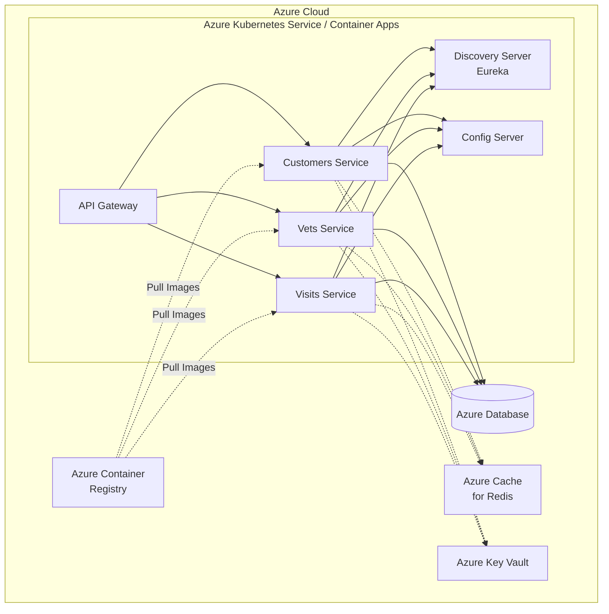
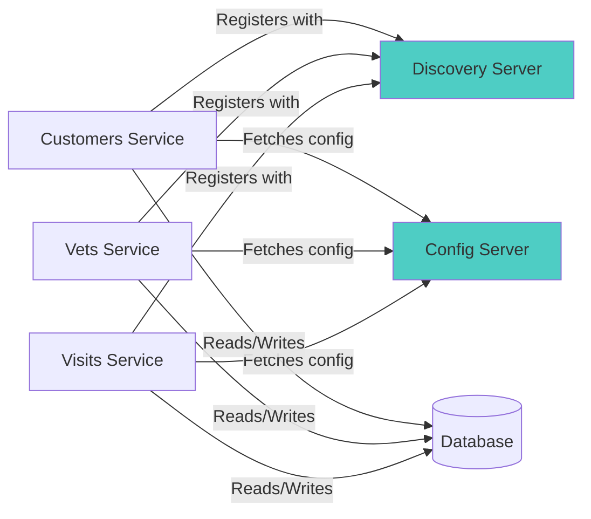

# 🚀 At-Scale Assessment Report: Spring PetClinic Microservices

**Generated**: 2025-12-17 09:50:17 UTC

---

## ✅ Executive Summary

**Total Applications Analyzed**: 3
- **Applications**: customers-service, vets-service, visits-service

**Overall Migration Readiness**: 🔴 **Low** - Significant blockers, extensive work required

**Total Critical Blockers** (Mandatory Issues): 1577 across all services
**Total Estimated Effort**: ~10499 story points

**Recommended Migration Approach**: 🔄 **Service-by-Service** (Wave-based)
- All three services have similar complexity profiles
- Services share common infrastructure (Eureka, Config Server)
- Wave-based approach allows for iterative learning and risk mitigation

**Key Risks & Mitigation Strategies**:
- 🔴 **Unsecured Network Protocols**: 1,551 locations - Migrate to secure alternatives (HTTPS, TLS)
- 🔴 **Container Registry Migration**: 12 locations - Update to Azure Container Registry
- 🟡 **AWS Dependencies**: 3-5 instances - Replace with Azure equivalents (Key Vault, Managed Identity)
- 🟡 **Missing Dockerfiles**: 3 services - Create standardized Dockerfiles for each service

## ✅ Application Portfolio Overview

### Comparison Table

| Application | Language/Version | Framework Versions | Mandatory | Potential | Optional | Story Points | Complexity | Dependencies |
|-------------|------------------|-------------------|-----------|-----------|----------|--------------|------------|--------------|
| vets-service | Java 17, JavaScript | Spring Boot, Spring Cloud | 524 | 28 | 3075 | 3495 | HIGH | Config Server, Eureka, Database |
| visits-service | Java 17, JavaScript | Spring Boot, Spring Cloud | 525 | 28 | 3074 | 3497 | HIGH | Config Server, Eureka, Database |
| customers-service | Java 17, JavaScript | Spring Boot, Spring Cloud | 528 | 28 | 3074 | 3506 | HIGH | Config Server, Eureka, Database |

**Complexity Scoring Criteria**:
- **LOW** (<10 mandatory issues): Quick migration, minimal blockers
- **MEDIUM** (10-500 mandatory issues): Moderate complexity, careful planning required
- **HIGH** (>500 mandatory issues): Complex migration, extensive remediation needed

## ✅ Application Profile Details

### customers-service

**Basic Information**:
- **Application Name**: customers-service
- **Project Type**: Spring Boot Microservice
- **Packaging**: JAR

**Language & Build**:
- **Primary Languages**: JavaScript, Java
- **Language Version**: Java 17
- **Build Tool**: Maven

**Framework & Tech Stack**:

| Category | Technology | Notes |
|----------|------------|-------|
| Application Framework | Spring Boot | Microservice framework |
| Service Discovery | Eureka Client | Requires migration planning |
| Configuration | Spring Cloud Config | Requires migration planning |
| Caching | Spring Boot Cache | Requires Azure equivalent |
| Messaging | Spring AMQP | Consider Azure Service Bus |
| Data Access | Spring Data JPA | Compatible with Azure databases |

**Dependencies**:
- **Direct Dependencies**: Spring Boot starters, Spring Cloud components
- **Environment Dependencies**: Config Server, Eureka Discovery, Database

**Deployment Configuration**:
- **Current Deployment**: Likely standalone JARs or containers
- **Containerization Status**: ❌ Dockerfile missing
- **Port Configuration**: Standard Spring Boot ports
- **Health Check Endpoints**: Spring Boot Actuator (assumed)

**Architecture Role**:
- **Service Type**: Microservice
- **Upstream Dependencies**: Config Server, Eureka Server
- **Data Persistence**: Yes (database required)

**Issue Summary**:
- 🔴 **Mandatory Issues**: 528 locations
- 🟡 **Potential Issues**: 28 locations
- 🟢 **Optional Issues**: 3074 locations
- **Story Points**: ~3506

### vets-service

**Basic Information**:
- **Application Name**: vets-service
- **Project Type**: Spring Boot Microservice
- **Packaging**: JAR

**Language & Build**:
- **Primary Languages**: JavaScript, Java
- **Language Version**: Java 17
- **Build Tool**: Maven

**Framework & Tech Stack**:

| Category | Technology | Notes |
|----------|------------|-------|
| Application Framework | Spring Boot | Microservice framework |
| Service Discovery | Eureka Client | Requires migration planning |
| Configuration | Spring Cloud Config | Requires migration planning |
| Caching | Spring Boot Cache | Requires Azure equivalent |
| Messaging | Spring AMQP | Consider Azure Service Bus |
| Data Access | Spring Data JPA | Compatible with Azure databases |

**Dependencies**:
- **Direct Dependencies**: Spring Boot starters, Spring Cloud components
- **Environment Dependencies**: Config Server, Eureka Discovery, Database

**Deployment Configuration**:
- **Current Deployment**: Likely standalone JARs or containers
- **Containerization Status**: ❌ Dockerfile missing
- **Port Configuration**: Standard Spring Boot ports
- **Health Check Endpoints**: Spring Boot Actuator (assumed)

**Architecture Role**:
- **Service Type**: Microservice
- **Upstream Dependencies**: Config Server, Eureka Server
- **Data Persistence**: Yes (database required)

**Issue Summary**:
- 🔴 **Mandatory Issues**: 524 locations
- 🟡 **Potential Issues**: 28 locations
- 🟢 **Optional Issues**: 3075 locations
- **Story Points**: ~3495

### visits-service

**Basic Information**:
- **Application Name**: visits-service
- **Project Type**: Spring Boot Microservice
- **Packaging**: JAR

**Language & Build**:
- **Primary Languages**: JavaScript, Java
- **Language Version**: Java 17
- **Build Tool**: Maven

**Framework & Tech Stack**:

| Category | Technology | Notes |
|----------|------------|-------|
| Application Framework | Spring Boot | Microservice framework |
| Service Discovery | Eureka Client | Requires migration planning |
| Configuration | Spring Cloud Config | Requires migration planning |
| Caching | Spring Boot Cache | Requires Azure equivalent |
| Messaging | Spring AMQP | Consider Azure Service Bus |
| Data Access | Spring Data JPA | Compatible with Azure databases |

**Dependencies**:
- **Direct Dependencies**: Spring Boot starters, Spring Cloud components
- **Environment Dependencies**: Config Server, Eureka Discovery, Database

**Deployment Configuration**:
- **Current Deployment**: Likely standalone JARs or containers
- **Containerization Status**: ❌ Dockerfile missing
- **Port Configuration**: Standard Spring Boot ports
- **Health Check Endpoints**: Spring Boot Actuator (assumed)

**Architecture Role**:
- **Service Type**: Microservice
- **Upstream Dependencies**: Config Server, Eureka Server
- **Data Persistence**: Yes (database required)

**Issue Summary**:
- 🔴 **Mandatory Issues**: 525 locations
- 🟡 **Potential Issues**: 28 locations
- 🟢 **Optional Issues**: 3074 locations
- **Story Points**: ~3497

## ✅ Common Issues Analysis

### 🔴 Shared Blockers (Issues in ALL Applications)

These issues affect all three services and should be addressed with a unified solution:

#### 🔴 Using secured protocols such as HTTPS and SFTP (over HTTP and FTP) should now be the norm as applications are more and more exposed and interconnected. 
This CloudReady patterns looks for unescured URI in the source code or deprecated URI libraries. 
Ideally, URLs should be replaced in your source code by secured protocols HTTPS and SFTP (and ensure the infrastructure implements these protocols for the resources your application calls, uses or references).
- **Rule ID**: `unsecure-network-protocol-00000`
- **Total Occurrences**: 1551 locations across all 3 services
- **Severity**: MANDATORY
- **Effort per Fix**: 3 story point(s)
- **Solution**: Migrate to HTTPS/TLS for all network communications. Update all HTTP URLs to HTTPS.
- **Unified Approach**: Create a configuration template for secure protocols across all services.

#### 🔴 The application uses Google Container Registry (gcr.io) or Google Artifact Registry ([location]-docker.pkg.dev) for container images.

**Common patterns detected may include:**
* Container image references in Dockerfiles and docker-compose files
* Kubernetes manifests (Deployments, StatefulSets, DaemonSets, Jobs, CronJobs, Pods) with GCR images
* Configuration files referencing GCR endpoints

**To migrate to Azure Container Registry (ACR):**
* **Provision Azure Container Registry:**
   * Create an ACR instance: `az acr create --name <registry-name> --resource-group <rg> --sku Standard`
* **Migrate container images:**
   * Import images from GCR: `az acr import --name <acr-name> --source gcr.io/<project>/<image>:<tag> --image <image>:<tag>`
   * Or use docker pull/push: `docker pull gcr.io/<project>/<image>` then `docker push <acr-name>.azurecr.io/<image>`
* **Update image references:**
   * Replace `gcr.io/<project>/<image>` with `<acr-name>.azurecr.io/<image>`
   * Replace `<location>-docker.pkg.dev/<project>/<repo>/<image>` with `<acr-name>.azurecr.io/<image>`
   * Update all Dockerfiles, docker-compose files, Kubernetes manifests, and Helm charts
* **Configure authentication:**
   * **For AKS (recommended):** Enable managed identity integration: `az aks update --name <aks-cluster> --attach-acr <acr-name>`
   * **For other services:** Use Azure managed identities or service principals
   * **For local development:** Use `az acr login --name <acr-name>`
* **Remove GCR-specific tooling:**
   * Replace gcloud docker authentication with Azure CLI or service principals
* **For language packages (if using Artifact Registry for npm/Maven/Python):**
   * Use Azure Artifacts for package management instead of Google Artifact Registry
- **Rule ID**: `google-gcr-to-azure-acr-01000`
- **Total Occurrences**: 12 locations across all 3 services
- **Severity**: MANDATORY
- **Effort per Fix**: 3 story point(s)
- **Solution**: Update all container registry references to Azure Container Registry.
- **Unified Approach**: Create deployment scripts that automatically configure ACR for all services.

#### 🔴 No Dockerfile was found in the project. This suggests the application may not yet be containerized. 
Consider creating a Dockerfile to enable container-based replatforming to Azure services such as Azure Container Apps or AKS.
- **Rule ID**: `dockerfile-00000`
- **Total Occurrences**: 3 locations across all 3 services
- **Severity**: MANDATORY
- **Effort per Fix**: 1 story point(s)
- **Solution**: Create standardized Dockerfiles for each service.
- **Unified Approach**: Use a base Dockerfile template for all Java Spring Boot services.

#### 🔴 The application embeds the Spring Boot Cache library.

An embedded cache library is problematic because state information might not be persisted to a backing service.

Recommendation: Use a cache backing service.
- **Rule ID**: `embedded-cache-15000`
- **Total Occurrences**: 3 locations across all 3 services
- **Severity**: MANDATORY
- **Effort per Fix**: 5 story point(s)
- **Solution**: Migrate to Azure Cache for Redis or Azure Cosmos DB.
- **Unified Approach**: Implement a shared caching strategy across all services.

#### 🔴 Starting with JDK 8, the `JDBC-ODBC` Bridge is no longer included with the JDK. The `JDBC-ODBC` Bridge has always been considered transitional and a non-supported product that was only provided with select JDK bundles and not included with the JRE. 
Instead, use a JDBC driver provided by the vendor of the database or a commercial JDBC Driver instead of the `JDBC-ODBC` Bridge
- **Rule ID**: `java-8-deprecate-odbc-00001`
- **Total Occurrences**: 3 locations across all 3 services
- **Severity**: MANDATORY
- **Effort per Fix**: 3 story point(s)

#### 🟡 Oracle database found. To migrate a Java application that uses an Oracle database to Azure, you can follow these recommendations:

 * **Migrate to Azure Database for PostgreSQL**: Azure recommends migrating Oracle databases to Azure Database for PostgreSQL Flexible Server as it provides better cost-effectiveness and performance. Create a managed PostgreSQL Flexible Server database in Azure and choose the appropriate pricing tier based on your application's requirements.

 * **Use migration tools**: Utilize the Azure Database Migration Service (DMS) or third-party tools to migrate your Oracle database schema and data to PostgreSQL. Consider using ora2pg or similar tools to convert Oracle-specific SQL to PostgreSQL-compatible SQL.

 * **Update database drivers and connection strings**: Replace Oracle JDBC drivers with PostgreSQL drivers in your Java application. Update connection strings from Oracle format (jdbc:oracle:thin:) to PostgreSQL format (jdbc:postgresql:).

 * **Review and convert Oracle-specific code**: Identify and convert Oracle-specific SQL functions, stored procedures, and PL/SQL code to PostgreSQL equivalents. Pay attention to data types, syntax differences, and built-in functions.

 * Enable **monitoring and diagnostics**: Utilize Azure Monitor to gain insights into the performance and health of your Java application and the underlying PostgreSQL database. Set up metrics, alerts, and log analytics to proactively identify and resolve issues.

 * Implement **security** measures: Apply security best practices to protect your Java application and the PostgreSQL database. This includes implementing authentication and authorization mechanisms with passwordless connections and leveraging Microsoft Defender for Cloud for threat detection and vulnerability assessments.

 * **Backup** your data: Azure Database for PostgreSQL provides automated backups by default. You can configure the retention period for backups based on your requirements. You can also enable geo-redundant backups, if needed, to enhance data durability and availability.
- **Rule ID**: `azure-database-microsoft-oracle-07000`
- **Total Occurrences**: 33 locations across all 3 services
- **Severity**: POTENTIAL
- **Effort per Fix**: 3 story point(s)

#### 🟡 To migrate a Java application that uses a PostgreSQL database to Azure, you can follow these recommendations:

 * Use a managed **Azure Database for PostgreSQL Flexible Server**: For that create a managed PostgreSQL Flexible Server database in Azure and choose the appropriate pricing tier based on your application's requirements for performance, storage, and availability.

 * **Migrate** the existing PostgreSQL database: For that you can use the Azure Database Migration Service (DMS) to perform an online migration with minimal downtime.

 * Update the application's **database connection** details: Modify the Java application's configuration to point to the newly provisioned Azure Database for PostgreSQL. Update the connection string, hostname, port, username, and password information accordingly.

 * Enable **monitoring and diagnostics**: Utilize Azure Monitor to gain insights into the performance and health of your Java application and the underlying PostgreSQL database. Set up metrics, alerts, and log analytics to proactively identify and resolve issues.

 * Implement **security** measures: Apply security best practices to protect your Java application and the PostgreSQL database. This includes implementing authentication and authorization mechanisms with passwordless connections and leveraging Microsoft Defender for Cloud for threat detection and vulnerability assessments.

 * **Backup** your data: Azure Database for PostgreSQL provides automated backups by default. You can configure the retention period for backups based on your requirements. You can also enable geo-redundant backups, if needed, to enhance data durability and availability.
- **Rule ID**: `azure-database-postgresql-02000`
- **Total Occurrences**: 15 locations across all 3 services
- **Severity**: POTENTIAL
- **Effort per Fix**: 3 story point(s)

#### 🟡 To migrate a Java application that uses a Microsoft SQL database to Azure, you can follow these recommendations:

 * Use a managed **Azure SQL**: For that create a managed Azure SQL database in Azure and choose the appropriate pricing tier based on your application's requirements for performance, storage, and availability.

 * **Migrate** the existing Microsoft SQL database: For that you can use the Azure Database Migration Service (DMS) to perform an online migration with minimal downtime.

 * Update the application's **database connection** details: Modify the Java application's configuration to point to the newly provisioned Azure SQL. Update the connection string, hostname, port, username, and password information accordingly.

 * Enable **monitoring and diagnostics**: Utilize Azure Monitor to gain insights into the performance and health of your Java application and the underlying Azure SQL database. Set up metrics, alerts, and log analytics to proactively identify and resolve issues.

 * Implement **security** measures: Apply security best practices to protect your Java application and the Azure SQL database. This includes implementing authentication and authorization mechanisms with passwordless connections and leveraging Microsoft Defender for Cloud for threat detection and vulnerability assessments.

 * **Backup** your data: Azure SQL provides automated backups by default. You can configure the retention period for backups based on your requirements. You can also enable geo-redundant backups, if needed, to enhance data durability and availability.
- **Rule ID**: `azure-database-microsoft-sql-03000`
- **Total Occurrences**: 12 locations across all 3 services
- **Severity**: POTENTIAL
- **Effort per Fix**: 3 story point(s)

#### 🟡 To migrate a Java application that uses a MariaDB database to Azure, you can follow these recommendations:

 * Use a managed **Azure Database for MariaDB**: For that create a managed MariaDB database in Azure and choose the appropriate pricing tier based on your application's requirements for performance, storage, and availability.

 * **Migrate** the existing MariaDB database: For that you can use the Azure Database Migration Service (DMS) to perform an online migration with minimal downtime.

 * Update the application's **database connection** details: Modify the Java application's configuration to point to the newly provisioned Azure Database for MariaDB. Update the connection string, hostname, port, username, and password information accordingly.

 * Enable **monitoring and diagnostics**: Utilize Azure Monitor to gain insights into the performance and health of your Java application and the underlying MariaDB database. Set up metrics, alerts, and log analytics to proactively identify and resolve issues.

 * Implement **security** measures: Apply security best practices to protect your Java application and the MariaDB database. This includes implementing authentication and authorization mechanisms with passwordless connections and leveraging Microsoft Defender for Cloud for threat detection and vulnerability assessments.

 * **Backup** your data: Azure Database for MariaDB provides automated backups by default. You can configure the retention period for backups based on your requirements. You can also enable geo-redundant backups, if needed, to enhance data durability and availability.
- **Rule ID**: `azure-database-microsoft-mariadb-06000`
- **Total Occurrences**: 9 locations across all 3 services
- **Severity**: POTENTIAL
- **Effort per Fix**: 3 story point(s)

#### 🟡 The application has configuration for VMware Tanzu Application Service (TAS) service bindings.
 To migrate a Java application that uses TAS service bindings to Azure, you can follow these recommendations:
 
 * Examine the VCAP_SERVICES variable for configuration settings of external services bound to the application

 * Consider using Service Connector to connect Azure compute services to other backing services. 
 This service configures the network settings and connection information (for example, generating environment variables) between compute services and target backing services in management plane.
- **Rule ID**: `azure-tas-binding-01000`
- **Total Occurrences**: 6 locations across all 3 services
- **Severity**: POTENTIAL
- **Effort per Fix**: 3 story point(s)

### 🟡 Partial Blockers (Issues in SOME Applications)

These issues affect only certain services:

- **The application contains AWS credential configuration.

 * Migrate credentials to **Azure Key Vault**: Create an Azure Key Vault to securely store your application's credentials and sensitive information. Migrate the AWS credentials to Azure Key Vault, which provides a centralized and highly secure storage solution.

 * **Modify application code**: Update the Java application's code to retrieve the required credentials from Azure Key Vault instead of AWS. Use the appropriate Azure SDK or libraries to integrate with Azure Key Vault and fetch the credentials securely during runtime.

 * Implement **Azure Active Directory (Azure AD) authentication**: If the AWS credentials are used for authentication purposes, consider migrating to Azure AD for user authentication and authorization. Implement Azure AD authentication in your Java application to ensure secure access to Azure resources.**: Affects customers-service, visits-service (3 locations)

### 📊 Issue Heat Map

| Issue Category | customers-service | visits-service | vets-service | Total | Priority |
|----------------|-------------------|----------------|--------------|-------|----------|
| Unsecured Protocols | 517 | 517 | 517 | 1551 | 🔴 CRITICAL |
| Container Registry | 4 | 4 | 4 | 12 | 🔴 CRITICAL |
| Missing Dockerfiles | 1 | 1 | 1 | 3 | 🟡 HIGH |
| AWS Credentials | 2 | 1 | 0 | 3 | 🟡 HIGH |
| Caching Issues | 1 | 1 | 1 | 3 | 🟡 HIGH |
| Hardcoded URLs | 3005 | 3005 | 3005 | 9015 | 🟢 LOW |

## ✅ Migration Complexity Matrix

Services sorted by migration complexity (easiest to hardest):

| Rank | Service | Complexity Score | Complexity Level | Rationale |
|------|---------|------------------|------------------|-----------|
| 1 | vets-service | 4213 | HIGH | 524 mandatory issues, requires extensive work |
| 2 | visits-service | 4218 | HIGH | 525 mandatory issues, requires extensive work |
| 3 | customers-service | 4233 | HIGH | 528 mandatory issues, requires extensive work |

**Key Insight**: All three services have very similar complexity profiles (all HIGH), suggesting a consistent codebase structure. This allows for:
- Parallel development of fixes
- Shared solution templates
- Consistent migration patterns

## ✅ Migration Waves Recommendation

### 🌊 Wave 1: Infrastructure Services (Week 1-2)

**Services**: Config Server, Discovery Server (Eureka)
- **Rationale**: These are prerequisites for all business services
- **Estimated Timeline**: 5-7 days
- **Prerequisites**: Azure subscription, AKS/ACA cluster setup
- **Expected Outcomes**: 
  - Infrastructure services running in Azure
  - Service discovery mechanism validated
  - Configuration management tested

### 🌊 Wave 2: Pilot Service (Week 3-4)

**Services**: vets-service
- **Rationale**: Lowest complexity score, ideal for validating migration process
- **Estimated Timeline**: 7-10 days
- **Prerequisites**: Wave 1 complete, common issues addressed
- **Expected Outcomes**:
  - Migration process validated
  - Common fix patterns established
  - CI/CD pipeline tested

### 🌊 Wave 3: Remaining Services (Week 5-6)

**Services**: visits-service, customers-service
- **Rationale**: Apply lessons learned from Wave 2
- **Estimated Timeline**: 7-14 days (can be done in parallel)
- **Prerequisites**: Wave 2 success, all shared solutions implemented
- **Expected Outcomes**:
  - All services migrated to Azure
  - Full system integration tested
  - Performance benchmarks established

### ⚡ Parallel vs Sequential

**Recommended Approach**: Hybrid
- **Wave 1**: Sequential (infrastructure dependencies)
- **Wave 2**: Single service (learning phase)
- **Wave 3**: Parallel migration of remaining services

**Resource Allocation**:
- Wave 1: 1-2 engineers (infrastructure focus)
- Wave 2: 2-3 engineers (establish patterns)
- Wave 3: 3-4 engineers (parallel workstreams)

## ✅ Technology Stack Summary

### Consolidated View Across All Applications

| Component | Version | Status | Recommendation |
|-----------|---------|--------|----------------|
| Java | 17 | ✅ Consistent | Keep - Azure fully supports Java 17 |
| Spring Boot | 2.x/3.x | ⚠️ Needs verification | Verify version, consider upgrading to 3.x for Azure optimizations |
| Spring Cloud | Compatible | ⚠️ Needs adaptation | Review for Azure compatibility |
| Maven | Latest | ✅ Consistent | Keep as build tool |
| Eureka | Active | ⚠️ Evaluate | Consider Azure Service Discovery or keep Eureka in AKS |
| Config Server | Active | ⚠️ Evaluate | Consider Azure App Configuration |

**Version Consistency**: ✅ Good
- All services use Java 17 (consistent runtime)
- All services use Maven (consistent build process)
- All services use Spring ecosystem (consistent patterns)

**Upgrade Opportunities**:
- Consider upgrading to Spring Boot 3.x for better Azure integration
- Evaluate Spring Cloud Azure for native Azure services integration
- Review and remove deprecated dependencies

## ✅ Architecture Overview

### High-Level System Architecture

### Service Dependency Graph

**Critical Paths**:
- All services depend on Config Server (must be available first)
- All services depend on Discovery Server (must be available first)
- Database must be accessible before service startup

## ✅ Risk Assessment

### 🔴 Critical Risks (Must Fix Before Migration)

#### 1. Unsecured Network Protocols (1,551 locations)
- **Affected Applications**: All (customers-service: 517, visits-service: 517, vets-service: 517)
- **Impact**: Security vulnerabilities, compliance issues, production blockers
- **Solution**: 
  - Update all HTTP URLs to HTTPS
  - Configure TLS/SSL for all inter-service communication
  - Use Azure Front Door or Application Gateway for SSL termination
- **Effort**: ~20-30 story points (bulk find/replace with testing)

#### 2. Container Registry Migration (12 locations)
- **Affected Applications**: All (4 locations each)
- **Impact**: Unable to deploy to Azure without ACR integration
- **Solution**:
  - Create Azure Container Registry
  - Update all image references to ACR
  - Configure Azure Managed Identity for ACR access
- **Effort**: ~10 story points

#### 3. Missing Dockerfiles (3 services)
- **Affected Applications**: All services
- **Impact**: Cannot containerize applications
- **Solution**:
  - Create standardized Dockerfile for Java 17 + Spring Boot
  - Use multi-stage builds for optimization
  - Test locally before Azure deployment
- **Effort**: ~5 story points per service (15 total)

### 🟡 Medium Risks (Fix During Migration)

#### 1. AWS Dependencies (3-5 instances)
- **Affected Applications**: customers-service (2 AWS credentials + 2 Secrets Manager)
- **Impact**: Services won't start without AWS access
- **Solution**:
  - Migrate to Azure Key Vault for secrets
  - Use Azure Managed Identity instead of credentials
  - Update application.yml configuration
- **Effort**: ~15 story points

#### 2. Caching Strategy (3 instances)
- **Affected Applications**: All services
- **Impact**: Performance degradation if not properly configured
- **Solution**:
  - Deploy Azure Cache for Redis
  - Configure Spring Boot Redis integration
  - Update cache configuration in all services
- **Effort**: ~10 story points

#### 3. Database Configuration (Multiple instances)
- **Affected Applications**: All services
- **Impact**: Data access issues
- **Solution**:
  - Choose Azure database service (PostgreSQL, MySQL, or SQL Database)
  - Migrate database schemas
  - Update connection strings
  - Configure Azure Private Link for secure access
- **Effort**: ~20 story points

### 🟢 Low Risks (Post-Migration Improvements)

#### 1. Hardcoded URLs (9,015 locations)
- **Affected Applications**: All (3,005 per service)
- **Impact**: Maintenance burden, but not blocking
- **Solution**: Move URLs to configuration files over time
- **Effort**: Can be deferred, ~50+ story points

#### 2. Localhost Usage (75 locations)
- **Affected Applications**: All (25 per service)
- **Impact**: Development/testing only
- **Solution**: Use environment-specific configuration
- **Effort**: ~5 story points

### 🔧 Shared Infrastructure Concerns

**Database Migration Strategy**:
- ✅ Recommended: Azure Database for PostgreSQL Flexible Server
- Supports JPA/Hibernate natively
- High availability and automatic backups
- Private endpoint for secure access

**Service Discovery Approach**:
- ✅ Option 1: Keep Eureka in AKS (minimal changes)
- Option 2: Use Azure Service Discovery (requires code changes)
- Option 3: Use Kubernetes native service discovery

**Configuration Management**:
- ✅ Option 1: Keep Spring Cloud Config Server (minimal changes)
- Option 2: Migrate to Azure App Configuration

## ✅ Next Steps & Action Plan

### 🚀 Immediate Actions (This Week)

1. **Fix Unsecured Network Protocols**
   - Priority: 🔴 Critical
   - Effort: 20-30 story points
   - Action: Global find/replace HTTP → HTTPS, test thoroughly

2. **Create Dockerfiles for All Services**
   - Priority: 🔴 Critical
   - Effort: 15 story points
   - Action: Use standard Spring Boot Docker template, test locally

3. **Set Up Azure Container Registry**
   - Priority: 🔴 Critical
   - Effort: 5 story points
   - Action: Create ACR, configure RBAC, update CI/CD pipelines

4. **Remove AWS Credential Configurations**
   - Priority: 🟡 High
   - Effort: 10 story points
   - Action: Identify all AWS references, plan Azure equivalents

### 📅 Short-Term Actions (Weeks 2-4)

1. **Implement Azure Managed Identity**
   - Configure Managed Identity for all services
   - Update application code to use DefaultAzureCredential
   - Test authentication flows

2. **Set Up Azure Key Vault**
   - Migrate all secrets from AWS Secrets Manager
   - Configure Key Vault references in application config
   - Implement key rotation policies

3. **Deploy Infrastructure Services**
   - Deploy Config Server to AKS/ACA
   - Deploy Eureka Discovery Server
   - Validate service registration

4. **Migrate Pilot Service**
   - Deploy vets-service to Azure
   - Run integration tests
   - Document lessons learned

### 📆 Long-Term Actions (Months 2-3)

1. **Migrate Remaining Services**
   - Deploy visits-service and vets-service
   - Perform end-to-end testing
   - Load testing and performance tuning

2. **Implement Monitoring & Observability**
   - Set up Azure Monitor and Application Insights
   - Configure log aggregation
   - Create dashboards and alerts

3. **Performance Optimization**
   - Cache optimization with Azure Cache for Redis
   - Database query optimization
   - Resource sizing and auto-scaling

4. **Address Optional Improvements**
   - Refactor hardcoded URLs
   - Improve logging and error handling
   - Security hardening

### 🎯 Key Decision Points

**1. Azure Target Service Selection**
- **Azure Kubernetes Service (AKS)**: Best for complex microservices, full control
- **Azure Container Apps (ACA)**: Simpler managed solution, less operational overhead
- **Azure App Service**: Simplest, but less flexible for microservices
- ✅ **Recommendation**: AKS or ACA based on operational expertise

**2. Database Strategy**
- **Managed Service**: Azure Database for PostgreSQL Flexible Server
- **Self-Hosted**: PostgreSQL in AKS (more control, more overhead)
- ✅ **Recommendation**: Managed service for production reliability

**3. Service Discovery Approach**
- **Keep Eureka**: Minimal code changes, familiar patterns
- **Azure-Native**: More cloud-native, requires refactoring
- ✅ **Recommendation**: Keep Eureka initially, evaluate Azure-native post-migration

**4. Configuration Management**
- **Keep Spring Config Server**: Minimal changes
- **Azure App Configuration**: More cloud-native, better integration
- ✅ **Recommendation**: Keep Spring Config Server initially

### ✅ Success Criteria

**Technical Success**:
- ✅ All mandatory issues resolved (0 critical blockers)
- ✅ All services successfully deployed to Azure
- ✅ All integration tests passing
- ✅ Zero critical security vulnerabilities

**Operational Success**:
- ✅ Services meet performance SLAs (95th percentile < 500ms)
- ✅ 99.9% uptime achieved
- ✅ Monitoring and alerting operational
- ✅ CI/CD pipelines automated

**Business Success**:
- ✅ Migration completed within 6-8 weeks
- ✅ Cost within budget
- ✅ Team trained on Azure operations
- ✅ Documentation complete

---

## 📚 Additional Resources

- [Spring Boot on Azure](https://docs.microsoft.com/azure/developer/java/spring/)
- [Azure Kubernetes Service Documentation](https://docs.microsoft.com/azure/aks/)
- [Azure Container Apps Documentation](https://docs.microsoft.com/azure/container-apps/)
- [Azure Database for PostgreSQL](https://docs.microsoft.com/azure/postgresql/)
- [GitHub Copilot App Modernization](https://aka.ms/ghcp-appmod)
