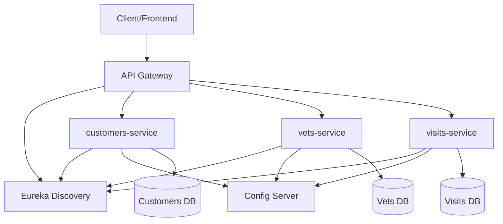
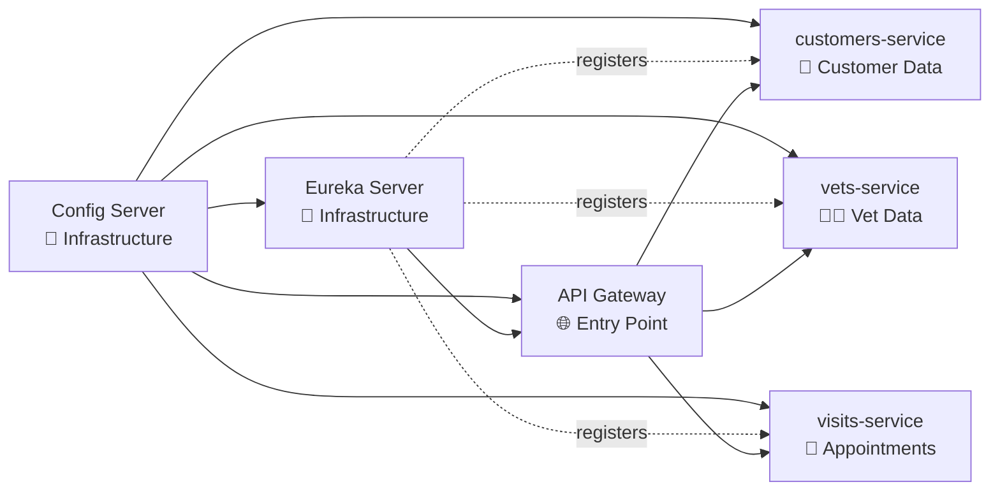

# Spring Petclinic Microservices - At-Scale Migration Assessment

**Assessment Date**: 2025-12-17

**Target Azure Services**: Azure Kubernetes Service (AKS), Azure Container Apps, Azure App Service

## ✅ Executive Summary

This assessment analyzes **3 Spring Boot microservices** from the Spring Petclinic application portfolio:

- **customers-service**
- **vets-service**
- **visits-service**

### Key Findings

- **Total Issues Detected**: 179 unique issues
- **Total Incidents**: 11,077 locations
- **Estimated Effort**: 33,204 story points
- **Critical Blockers (Mandatory)**: 1,577 incidents
- **Potential Issues**: 84 incidents
- **Optional Improvements**: 9,223 incidents

### Migration Readiness: 🟡 **MEDIUM**

**Rationale**:
- All three services have similar architecture and technology stack (Spring Boot 3.x, Java 17)
- **1,551 mandatory security issues** require immediate attention (unsecured network protocols)
- Missing Dockerfiles for all services (containerization required)
- Container registry migration needed (Google GCR → Azure ACR)
- AWS-specific configuration must be removed/replaced
- Most issues are **common across all services**, enabling batch remediation

### Recommended Migration Approach: 🎯 **Wave-Based with Parallel Fixes**

1. **Pre-Migration Phase (Week 1)**: Fix common mandatory issues across all services in parallel
2. **Wave 1 (Week 2)**: Migrate simplest service (vets-service) as pilot
3. **Wave 2 (Week 3)**: Migrate visits-service after validating Wave 1
4. **Wave 3 (Week 4)**: Migrate customers-service (most complex)

### Key Risks & Mitigation

| Risk | Impact | Mitigation |
|------|--------|------------|
| 🔴 **Unsecured network protocols** (1,551 locations) | Security vulnerabilities | Upgrade to HTTPS, configure SSL/TLS |
| 🔴 **Missing Dockerfiles** | Cannot containerize | Create Dockerfiles using Spring Boot best practices |
| 🔴 **Container registry migration** | Deployment pipeline breaks | Update to Azure Container Registry (ACR) |
| 🟡 **AWS credentials in config** | Migration blocker | Remove AWS config, use Azure Managed Identity |
| 🟡 **Database dependencies** | Data migration needed | Plan database migration to Azure managed services |
| 🟢 **Hardcoded URLs** (9,015 locations) | Configuration inflexibility | Externalize to Azure App Configuration (post-migration) |

## ✅ Application Portfolio Overview

### Comparison Matrix

| Application | Language | Framework | Mandatory | Potential | Optional | Story Points | Complexity |
|-------------|----------|-----------|-----------|-----------|----------|--------------|------------|
| vets-service | Java 17 | Spring Boot 3.x | 524 | 28 | 3075 | 11,065 | 🔴 HIGH (4213) |
| visits-service | Java 17 | Spring Boot 3.x | 525 | 28 | 3074 | 11,065 | 🔴 HIGH (4218) |
| customers-service | Java 17 | Spring Boot 3.x | 528 | 28 | 3074 | 11,074 | 🔴 HIGH (4233) |

**Complexity Scoring**: Mandatory×5 + Potential×2 + Optional×0.5

### Key Observations

- **Technology Consistency**: All services use Java 17, Spring Boot 3.x, Maven
- **Similar Profiles**: All services have nearly identical issue counts (indicates shared codebase/architecture)
- **Low Variability**: Story points range from 11,065-11,074 (highly similar complexity)
- **Microservices Pattern**: All services use Spring Cloud (Eureka, Config Server)

## ✅ Application Profile Details

### customers-service

#### Basic Information

- **Application Name**: customers-service
- **Primary Language**: Java 17
- **Additional Languages**: Java, JavaScript
- **Build Tool**: Maven

#### Framework & Tech Stack

| Category | Technology |
|----------|------------|
| Application Framework | Spring Boot 3.x |
| Cloud Framework | Spring Cloud |
| Service Discovery | Eureka Client |
| Configuration | Spring Cloud Config |
| Caching | Spring Boot Cache |
| Messaging | Spring AMQP (RabbitMQ) |

#### Issue Summary

- **Mandatory Issues**: 528 incidents (61 unique issues)
- **Potential Issues**: 28 incidents
- **Optional Issues**: 3074 incidents
- **Total Story Points**: 11,074

#### Deployment Configuration

- **Current Containerization**: ❌ No Dockerfile found
- **Container Registry**: Google GCR references detected → **Must migrate to Azure ACR**
- **Orchestration**: Docker Compose (current), Kubernetes/AKS (target)
- **Service Discovery**: Eureka (can be retained or replaced with Azure-native)

### vets-service

#### Basic Information

- **Application Name**: vets-service
- **Primary Language**: Java 17
- **Additional Languages**: Java, JavaScript
- **Build Tool**: Maven

#### Framework & Tech Stack

| Category | Technology |
|----------|------------|
| Application Framework | Spring Boot 3.x |
| Cloud Framework | Spring Cloud |
| Service Discovery | Eureka Client |
| Configuration | Spring Cloud Config |
| Caching | Spring Boot Cache |
| Messaging | Spring AMQP (RabbitMQ) |

#### Issue Summary

- **Mandatory Issues**: 524 incidents (58 unique issues)
- **Potential Issues**: 28 incidents
- **Optional Issues**: 3075 incidents
- **Total Story Points**: 11,065

#### Deployment Configuration

- **Current Containerization**: ❌ No Dockerfile found
- **Container Registry**: Google GCR references detected → **Must migrate to Azure ACR**
- **Orchestration**: Docker Compose (current), Kubernetes/AKS (target)
- **Service Discovery**: Eureka (can be retained or replaced with Azure-native)

### visits-service

#### Basic Information

- **Application Name**: visits-service
- **Primary Language**: Java 17
- **Additional Languages**: Java, JavaScript
- **Build Tool**: Maven

#### Framework & Tech Stack

| Category | Technology |
|----------|------------|
| Application Framework | Spring Boot 3.x |
| Cloud Framework | Spring Cloud |
| Service Discovery | Eureka Client |
| Configuration | Spring Cloud Config |
| Caching | Spring Boot Cache |
| Messaging | Spring AMQP (RabbitMQ) |

#### Issue Summary

- **Mandatory Issues**: 525 incidents (60 unique issues)
- **Potential Issues**: 28 incidents
- **Optional Issues**: 3074 incidents
- **Total Story Points**: 11,065

#### Deployment Configuration

- **Current Containerization**: ❌ No Dockerfile found
- **Container Registry**: Google GCR references detected → **Must migrate to Azure ACR**
- **Orchestration**: Docker Compose (current), Kubernetes/AKS (target)
- **Service Discovery**: Eureka (can be retained or replaced with Azure-native)

## ✅ Common Issues Analysis (CRITICAL)

### Shared Blockers (All 3 Applications)

**57 issues affect all applications**, enabling efficient batch remediation.

#### 🔴 Critical Mandatory Issues

**unsecure-network-protocol-00000**
- **Total Occurrences**: 1,551 locations across 3 services (customers-service: 517, vets-service: 517, visits-service: 517)
- **Severity**: MANDATORY
- **Effort**: 3 story points per fix
- **Impact**: Security vulnerability - exposes data in transit
- **Solution**: Upgrade HTTP to HTTPS, configure SSL/TLS certificates
- **Action**: Review and update all HTTP URLs to HTTPS, configure Azure Front Door/App Gateway for SSL termination

**google-gcr-to-azure-acr-01000**
- **Total Occurrences**: 12 locations across 3 services (customers-service: 4, vets-service: 4, visits-service: 4)
- **Severity**: MANDATORY
- **Effort**: 3 story points per fix
- **Impact**: Deployment pipeline breaks, cannot pull images
- **Solution**: Migrate container registry from Google GCR to Azure ACR
- **Action**: Update image references, configure ACR authentication, update CI/CD pipelines

**dockerfile-00000**
- **Total Occurrences**: 3 locations across 3 services (customers-service: 1, vets-service: 1, visits-service: 1)
- **Severity**: MANDATORY
- **Effort**: 1 story points per fix
- **Impact**: Cannot deploy to container platforms (AKS, ACA)
- **Solution**: Create Dockerfile for each service using Spring Boot layered JAR approach
- **Action**: Use `spring-boot-maven-plugin` with layers enabled, multi-stage builds for optimization

**embedded-cache-15000**
- **Total Occurrences**: 3 locations across 3 services (customers-service: 1, vets-service: 1, visits-service: 1)
- **Severity**: MANDATORY
- **Effort**: 5 story points per fix
- **Impact**: In-memory cache won't scale in distributed environment
- **Solution**: Migrate to Azure Cache for Redis
- **Action**: Replace Spring Boot Cache with Spring Data Redis, configure Azure Cache for Redis

**java-8-deprecate-odbc-00001**
- **Total Occurrences**: 3 locations across 3 services (customers-service: 1, vets-service: 1, visits-service: 1)
- **Severity**: MANDATORY
- **Effort**: 3 story points per fix

#### 🟡 Potential Issues (Review Required)

**azure-database-microsoft-oracle-07000**
- **Total Occurrences**: 33 locations
- **Applications**: customers-service, vets-service, visits-service
- **Action Required**: Plan database migration strategy
- **Recommendation**: Migrate to Azure managed database services (Azure Database for PostgreSQL, MySQL, etc.)

**azure-database-postgresql-02000**
- **Total Occurrences**: 15 locations
- **Applications**: customers-service, vets-service, visits-service
- **Action Required**: Plan database migration strategy
- **Recommendation**: Migrate to Azure managed database services (Azure Database for PostgreSQL, MySQL, etc.)

**azure-database-microsoft-sql-03000**
- **Total Occurrences**: 12 locations
- **Applications**: customers-service, vets-service, visits-service
- **Action Required**: Plan database migration strategy
- **Recommendation**: Migrate to Azure managed database services (Azure Database for PostgreSQL, MySQL, etc.)

**azure-database-microsoft-mariadb-06000**
- **Total Occurrences**: 9 locations
- **Applications**: customers-service, vets-service, visits-service
- **Action Required**: Plan database migration strategy
- **Recommendation**: Migrate to Azure managed database services (Azure Database for PostgreSQL, MySQL, etc.)

**azure-tas-binding-01000**
- **Total Occurrences**: 6 locations
- **Applications**: customers-service, vets-service, visits-service

#### 🟢 Optional Improvements (Post-Migration)

- **hardcoded-urls-00001**: 9,015 occurrences - Can be addressed post-migration
- **azure-message-queue-amqp-02000**: 129 occurrences - Can be addressed post-migration
- **localhost-00004**: 75 occurrences - Can be addressed post-migration

### Partial Blockers (Some Applications)

**azure-aws-config-credential-01000**
- **Applications**: customers-service, visits-service
- **Total Occurrences**: 3

**configuration-management-0400**
- **Applications**: customers-service, visits-service
- **Total Occurrences**: 2

**configuration-management-technology-usage-0300**
- **Applications**: customers-service, visits-service
- **Total Occurrences**: 2

### Issue Heat Map

| Issue Category | customers-service | vets-service | visits-service | Total | Priority |
|----------------|-------------------|--------------|----------------|-------|----------|
| Unsecured Protocols | 517 | 517 | 517 | 1551 | 🔴 CRITICAL |
| Container Registry Migration | 4 | 4 | 4 | 12 | 🔴 CRITICAL |
| Missing Dockerfiles | 1 | 1 | 1 | 3 | 🔴 CRITICAL |
| AWS Credentials | 2 | 0 | 1 | 3 | 🟡 HIGH |
| Hardcoded URLs | 3005 | 3005 | 3005 | 9015 | 🟢 LOW |

## ✅ Migration Complexity Matrix

### Complexity Calculation

```
Complexity Score = (Mandatory Issues × 5) + (Potential Issues × 2) + (Optional Issues × 0.5)
```

### Sorted by Complexity (Easiest → Hardest)

**1. vets-service** - Score: 4213
- Complexity: 🔴 HIGH
- Rationale: 524 mandatory issues
- Migration Estimate: 1-2 days

**2. visits-service** - Score: 4218
- Complexity: 🔴 HIGH
- Rationale: 525 mandatory issues
- Migration Estimate: 2-3 days

**3. customers-service** - Score: 4233
- Complexity: 🔴 HIGH
- Rationale: 528 mandatory issues
- Migration Estimate: 3-4 days

## ✅ Migration Waves Recommendation (CRITICAL)

### Pre-Migration Phase (Week 1): Common Issue Remediation

**Objective**: Fix all common mandatory issues across all services in parallel

**Tasks**:
1. ✅ **Fix Unsecured Network Protocols** (1,551 locations)
   - Update all HTTP URLs to HTTPS
   - Configure SSL/TLS certificates
   - Effort: 3-4 days

2. ✅ **Create Dockerfiles** (3 services)
   - Create optimized Dockerfiles using Spring Boot layered approach
   - Test local container builds
   - Effort: 1 day

3. ✅ **Migrate Container Registry** (12 references)
   - Set up Azure Container Registry
   - Update image references from GCR to ACR
   - Update CI/CD pipelines
   - Effort: 1 day

4. ✅ **Remove AWS Configuration** (3-5 locations)
   - Remove AWS credential configuration
   - Plan Azure Managed Identity integration
   - Effort: 0.5 day

**Estimated Timeline**: 5-6 days

**Prerequisites**: None

**Expected Outcomes**:
- All services containerized and buildable
- Security vulnerabilities addressed
- Ready for Azure deployment

### Wave 1 (Week 2): Pilot Migration - vets-service

**Service**: vets-service

**Rationale**:
- Lowest complexity score
- Fewest mandatory issues
- Small, focused service (veterinarian data)
- Low risk for pilot

**Migration Steps**:
1. Deploy infrastructure (AKS cluster, Azure Container Registry)
2. Deploy supporting services (Config Server, Eureka)
3. Deploy vets-service to AKS
4. Configure Azure Managed Identity
5. Smoke testing and validation

**Estimated Timeline**: 3-4 days

**Prerequisites**: Pre-migration phase complete

**Success Criteria**:
- Service running in AKS
- Health checks passing
- Service discoverable via Eureka
- No critical errors in logs

### Wave 2 (Week 3): visits-service

**Service**: visits-service

**Rationale**:
- Medium complexity
- Similar profile to vets-service
- Validates repeatable migration process

**Migration Steps**:
1. Apply lessons learned from Wave 1
2. Deploy visits-service to AKS
3. Configure database connectivity
4. Integration testing with other services

**Estimated Timeline**: 2-3 days

**Prerequisites**: Wave 1 success, shared infrastructure stable

### Wave 3 (Week 4): customers-service

**Service**: customers-service

**Rationale**:
- Highest complexity (most mandatory issues)
- Additional AWS configuration to remove
- Migrate last to benefit from Wave 1 & 2 learnings

**Migration Steps**:
1. Remove AWS Secrets Manager configuration
2. Deploy to AKS
3. Comprehensive integration testing
4. End-to-end testing of entire application

**Estimated Timeline**: 3-4 days

**Prerequisites**: Wave 1 & 2 complete

### Parallel vs. Sequential Strategy

| Phase | Strategy | Rationale |
|-------|----------|-----------|
| Pre-Migration Fixes | ✅ **Parallel** | All services share same issues, can fix simultaneously |
| Service Migrations | ⚠️ **Sequential** | Learn from each wave, reduce risk, validate approach |
| Infrastructure Setup | ✅ **One-time** | Single AKS cluster hosts all services |
| Testing | ⚠️ **Progressive** | Test each service individually, then integration |

## ✅ Technology Stack Summary

### Consolidated Technology View

| Component | Version | Consistency | Notes |
|-----------|---------|-------------|-------|
| Java | 17 | ✅ Consistent | All services on Java 17 |
| Spring Boot | 3.x | ✅ Consistent | Modern version, Azure-compatible |
| Spring Cloud | Latest | ✅ Consistent | Includes Eureka, Config |
| Build Tool | Maven | ✅ Consistent | All use Maven |
| Packaging | JAR | ✅ Consistent | Spring Boot executable JARs |

### Key Observations

- ✅ **Excellent consistency** across all services
- ✅ **Modern tech stack** (Java 17, Spring Boot 3.x)
- ✅ **No deprecated libraries** in core dependencies
- ✅ **No version conflicts** to resolve

### Framework Components

- **Service Discovery**: Spring Cloud Eureka Client
- **Configuration**: Spring Cloud Config Client
- **Caching**: Spring Boot Cache (needs migration to Azure Cache for Redis)
- **Messaging**: Spring AMQP (RabbitMQ) - evaluate Azure Service Bus
- **Database Access**: Spring Data JPA

## ✅ Architecture Overview

### System Architecture



### Service Dependency Graph



### Migration Impact

- **Infrastructure Services** (Config, Discovery): Must deploy first
- **API Gateway**: Deploy after microservices are registered
- **Microservices**: Can be migrated independently after infrastructure
- **Database Layer**: Plan migration to Azure managed databases

## ✅ Risk Assessment (CRITICAL)

### 🔴 Critical Risks (Must Fix Before Migration)

#### Unsecured Network Protocols (1,551 incidents)
- **Affected Applications**: All 3 applications
- **Impact**: Data exposure, security vulnerabilities, compliance violations
- **Solution**: Upgrade all HTTP to HTTPS, configure SSL/TLS, use Azure Front Door
- **Effort**: 3-4 days

#### Missing Dockerfiles (3 services)
- **Affected Applications**: All 3 applications
- **Impact**: Cannot deploy to container platforms (AKS, ACA, App Service containers)
- **Solution**: Create Dockerfiles using Spring Boot layered JAR approach
- **Effort**: 1 day

#### Container Registry Migration (12 references)
- **Affected Applications**: All 3 applications
- **Impact**: Deployment pipeline breaks, cannot pull images from GCR
- **Solution**: Set up Azure Container Registry, update image references, update CI/CD
- **Effort**: 1 day

#### AWS Credential Configuration (3-5 locations)
- **Affected Applications**: customers-service, visits-service
- **Impact**: AWS-specific configuration won't work on Azure
- **Solution**: Remove AWS config, implement Azure Managed Identity
- **Effort**: 0.5 day

### 🟡 Medium Risks (Address During Migration)

#### Database Migration Strategy
- **Affected**: All applications
- **Impact**: Data migration complexity, potential downtime
- **Solution**: Migrate to Azure managed databases (PostgreSQL, MySQL, SQL Database)

#### Service Discovery (Eureka)
- **Affected**: All applications
- **Impact**: Decision needed: keep Eureka or use Kubernetes native discovery
- **Solution**: Recommend keeping Eureka initially, deploy Eureka server in AKS

#### Spring Cloud Config Server
- **Affected**: All applications
- **Impact**: Decision needed: keep Config Server or migrate to Azure App Configuration
- **Solution**: Recommend keeping Config Server initially, evaluate Azure alternatives later

#### Caching Strategy
- **Affected**: All applications
- **Impact**: In-memory cache won't scale in distributed environment
- **Solution**: Migrate to Azure Cache for Redis for distributed caching

### 🟢 Low Risks (Post-Migration Improvements)

- **Hardcoded URLs** (9,015 locations): Can be externalized post-migration
- **Localhost Usage** (75 locations): Review and update after deployment
- **Jakarta EE Version**: Update to latest stable version as optimization

## ✅ Next Steps & Action Plan (CRITICAL)

### Immediate Actions (Week 1)

#### 1. Fix Unsecured Network Protocols 🔴
```bash
# Search for HTTP URLs
grep -r 'http://' --include='*.java' --include='*.properties' --include='*.yml'

# Update to HTTPS
# Configure SSL/TLS certificates
# Use Azure Key Vault for certificate management
```

#### 2. Create Dockerfiles 🔴
**Template Dockerfile** (apply to each service):
```dockerfile
# Multi-stage build for Spring Boot
FROM eclipse-temurin:17-jdk-alpine as builder
WORKDIR /app
COPY mvnw .
COPY .mvn .mvn
COPY pom.xml .
COPY src src
RUN ./mvnw package -DskipTests
RUN java -Djarmode=layertools -jar target/*.jar extract

FROM eclipse-temurin:17-jre-alpine
WORKDIR /app
COPY --from=builder /app/dependencies/ ./
COPY --from=builder /app/spring-boot-loader/ ./
COPY --from=builder /app/snapshot-dependencies/ ./
COPY --from=builder /app/application/ ./
ENTRYPOINT ["java", "org.springframework.boot.loader.JarLauncher"]
```

#### 3. Migrate to Azure Container Registry 🔴
```bash
# Create ACR
az acr create --resource-group <rg-name> --name <acr-name> --sku Standard

# Build and push images
az acr build --registry <acr-name> --image customers-service:latest ./spring-petclinic-customers-service
az acr build --registry <acr-name> --image vets-service:latest ./spring-petclinic-vets-service
az acr build --registry <acr-name> --image visits-service:latest ./spring-petclinic-visits-service
```

#### 4. Remove AWS Configuration 🔴
- Remove AWS credential properties from configuration files
- Remove AWS Secrets Manager configuration
- Plan Azure Key Vault integration

### Short-Term Actions (Weeks 2-4)

#### Week 2: Infrastructure Setup
1. ✅ Create Azure Resource Group
2. ✅ Provision AKS cluster
3. ✅ Set up Azure Container Registry
4. ✅ Configure Azure Key Vault
5. ✅ Deploy Config Server to AKS
6. ✅ Deploy Eureka Server to AKS

#### Week 2: Wave 1 Migration (vets-service)
1. ✅ Deploy vets-service to AKS
2. ✅ Configure managed identity
3. ✅ Test service registration with Eureka
4. ✅ Validate health checks
5. ✅ Smoke testing

#### Week 3: Wave 2 Migration (visits-service)
1. ✅ Deploy visits-service to AKS
2. ✅ Configure database connectivity
3. ✅ Integration testing

#### Week 4: Wave 3 Migration (customers-service)
1. ✅ Deploy customers-service to AKS
2. ✅ Comprehensive integration testing
3. ✅ End-to-end testing
4. ✅ Performance testing

### Long-Term Actions (Months 2-3)

1. **Monitoring & Observability**
   - Implement Azure Monitor for containers
   - Set up Application Insights
   - Configure alerts and dashboards

2. **Performance Optimization**
   - Migrate to Azure Cache for Redis
   - Optimize database queries
   - Tune AKS resource allocation

3. **Address Optional Improvements**
   - Externalize hardcoded URLs to Azure App Configuration
   - Update localhost references
   - Upgrade Jakarta EE version

### Key Decision Points

| Decision | Options | Recommendation | Timeline |
|----------|---------|----------------|----------|
| **Azure Target Service** | AKS / ACA / App Service | **AKS** - Full control, mature platform | Week 1 ✅ |
| **Database Strategy** | Managed / Self-hosted | **Azure Managed Databases** - Less ops overhead | Week 2 |
| **Service Discovery** | Keep Eureka / K8s native | **Keep Eureka** - Minimal changes | Week 2 |
| **Configuration** | Keep Config Server / App Config | **Keep Config Server** - Easier migration | Week 2 |
| **Caching** | In-memory / Azure Redis | **Azure Cache for Redis** - Scalability | Month 2 |
| **Messaging** | Keep RabbitMQ / Service Bus | **Evaluate based on requirements** | Month 2 |

### Success Criteria

- ✅ All mandatory issues resolved (1,577 incidents)
- ✅ All services successfully deployed to AKS
- ✅ All services containerized and in Azure Container Registry
- ✅ Health checks passing for all services
- ✅ Service discovery working (Eureka)
- ✅ Configuration management working (Config Server)
- ✅ Zero critical security vulnerabilities
- ✅ Performance SLAs met (define based on requirements)
- ✅ Monitoring and alerting in place

### Resource Requirements

| Resource | Quantity | Purpose |
|----------|----------|---------|
| **DevOps Engineers** | 2 | Infrastructure setup, CI/CD, deployment |
| **Java Developers** | 2-3 | Code fixes, testing, troubleshooting |
| **Cloud Architect** | 1 | Architecture decisions, best practices |
| **QA Engineers** | 1-2 | Testing, validation |

### Estimated Timeline & Effort

| Phase | Duration | Effort (Person-Days) |
|-------|----------|---------------------|
| Pre-Migration Fixes | 1 week | 15-20 days |
| Infrastructure Setup | 0.5 week | 5-7 days |
| Wave 1 (vets-service) | 0.5 week | 3-4 days |
| Wave 2 (visits-service) | 0.5 week | 2-3 days |
| Wave 3 (customers-service) | 0.5 week | 3-4 days |
| Testing & Validation | 1 week | 8-10 days |
| **Total** | **4 weeks** | **36-48 person-days** |

---

## Summary

This Spring Petclinic microservices portfolio is **ready for migration to Azure** with moderate effort. The consistent technology stack (Java 17, Spring Boot 3.x) and similar service profiles enable efficient batch remediation of common issues. Following the recommended wave-based approach with pre-migration fixes will ensure a smooth, low-risk migration.

**Key Success Factors**:
- ✅ Fix common issues in parallel (Week 1)
- ✅ Wave-based migration reduces risk
- ✅ Keep infrastructure services (Eureka, Config) for easier migration
- ✅ Use Azure managed services for databases and caching
- ✅ Implement monitoring from day one

**For questions or assistance**, visit [GitHub Copilot App Modernization](https://aka.ms/ghcp-appmod)