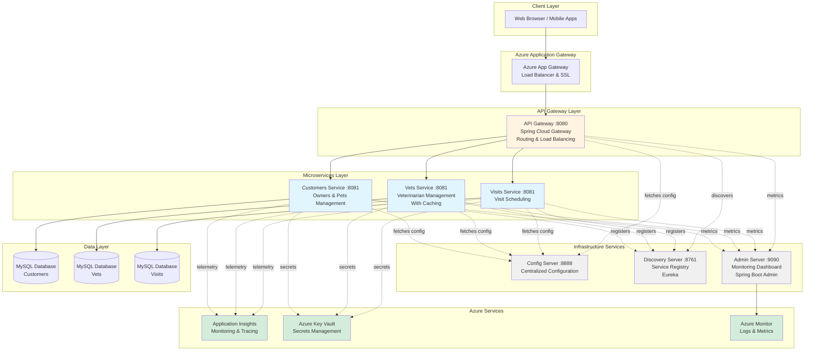
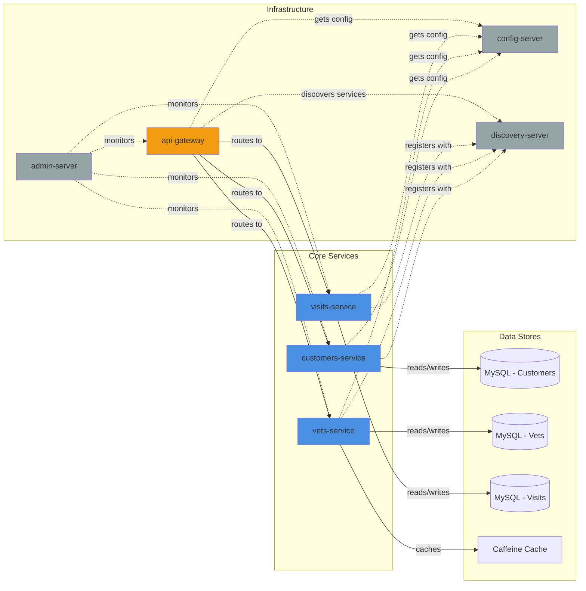
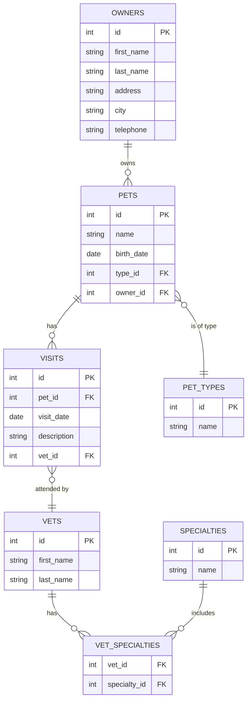
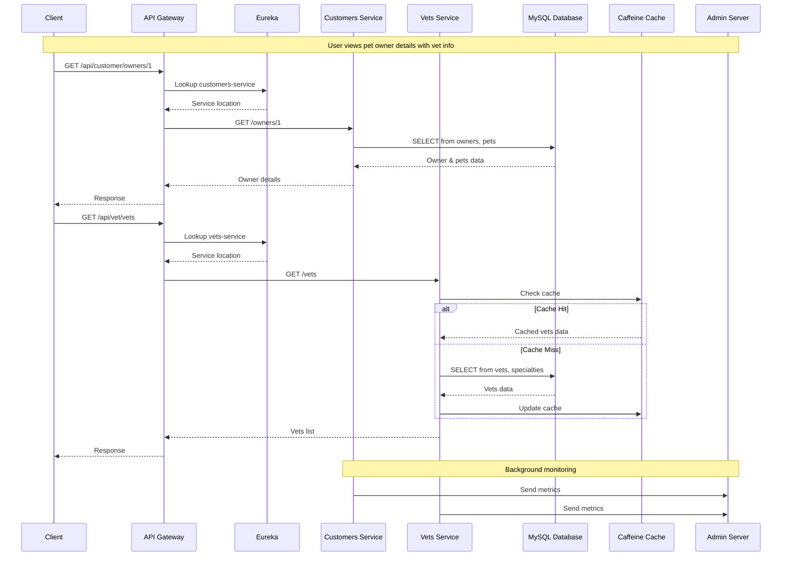
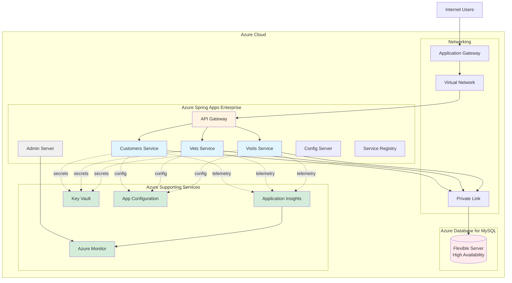
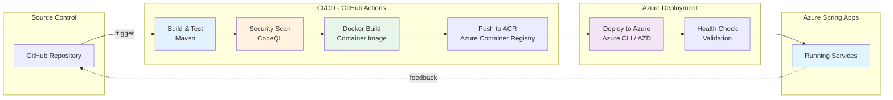
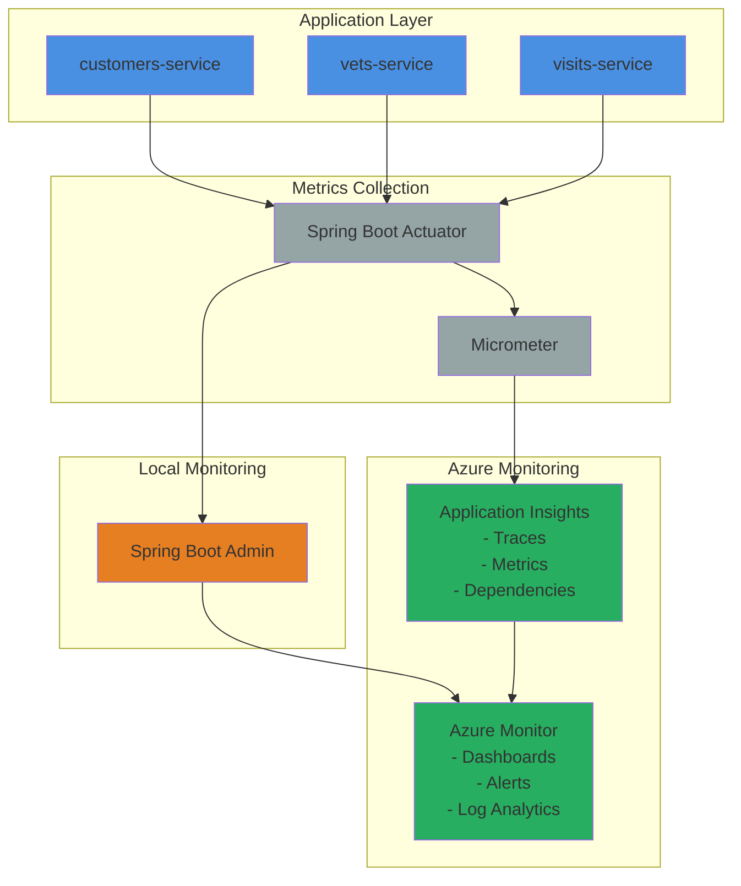
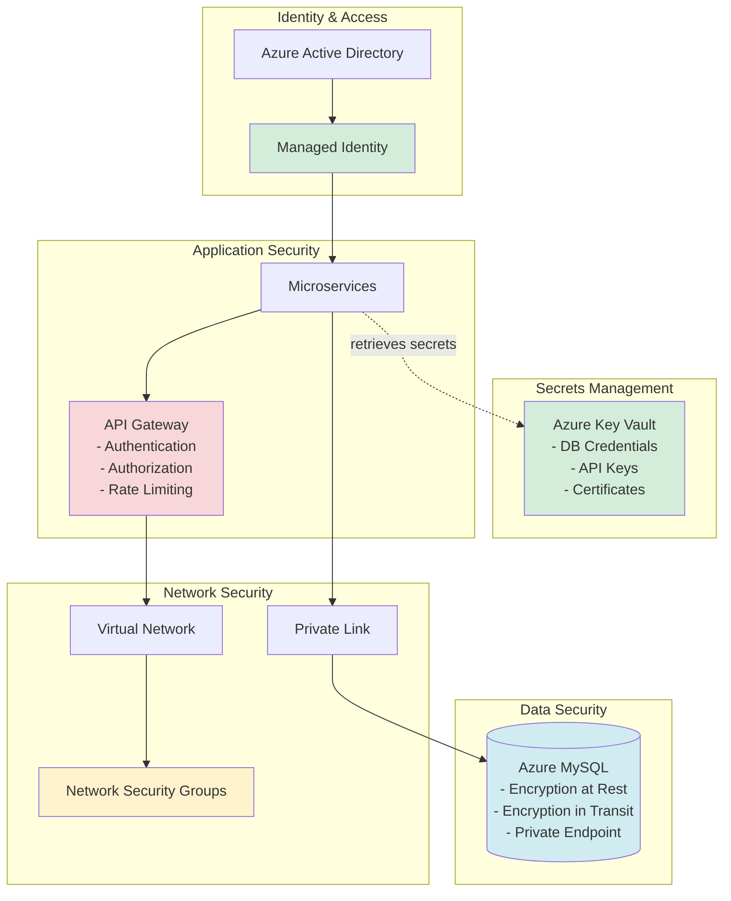
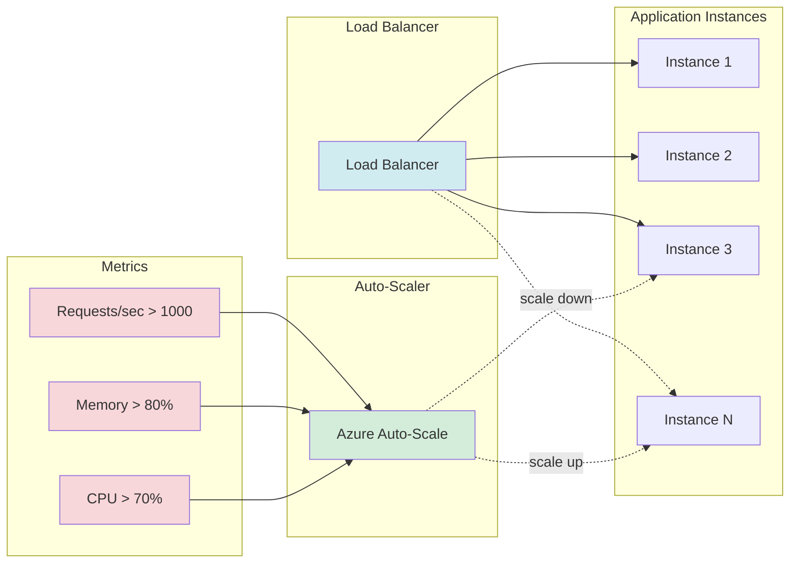

# Spring PetClinic Microservices - Visual Architecture Diagrams

This document contains Mermaid diagrams that can be rendered in GitHub, GitLab, and other Markdown viewers.

## 1. High-Level System Architecture

## 2. Service Dependencies and Interactions

## 3. Data Model Relationships

## 4. Request Flow Sequence

## 5. Azure Migration Architecture

## 6. Deployment Pipeline

## 7. Service Communication Patterns

```mermaid
graph TB
    subgraph "Synchronous Communication"
        Client[Client Request]
        Gateway[API Gateway]
        Service[Microservice]
        
        Client -->|REST API| Gateway
        Gateway -->|REST API| Service
        Service -->|Response| Gateway
        Gateway -->|Response| Client
    end
    
    subgraph "Service Discovery Pattern"
        ServiceA[Service A]
        Eureka[Eureka Server]
        ServiceB[Service B]
        
        ServiceA -.->|1. Register| Eureka
        ServiceB -.->|2. Query| Eureka
        Eureka -.->|3. Location| ServiceB
        ServiceB -->|4. Call| ServiceA
    end
    
    subgraph "Configuration Pattern"
        App[Application]
        ConfigServer[Config Server]
        GitRepo[(Git Repository)]
        
        App -.->|1. Request Config| ConfigServer
        ConfigServer -.->|2. Fetch| GitRepo
        GitRepo -.->|3. Return| ConfigServer
        ConfigServer -.->|4. Provide| App
    end
```

## 8. Monitoring and Observability

## 9. Security Architecture

## 10. Scaling Strategy

---

## How to View These Diagrams

### GitHub
These Mermaid diagrams will render automatically when viewing this file on GitHub.

### VS Code
Install the "Markdown Preview Mermaid Support" extension to view these diagrams in VS Code.

### Other Tools
- Use [Mermaid Live Editor](https://mermaid.live/) to view and edit
- Many Markdown editors support Mermaid natively
- GitLab, Azure DevOps, and other platforms support Mermaid rendering

---

**Document Version:** 1.0  
**Last Updated:** December 9, 2025  
**Format:** Mermaid Diagrams
