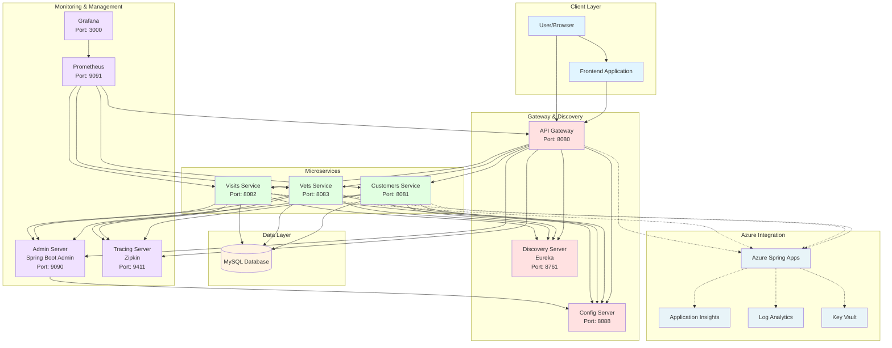

# Spring PetClinic Microservices Architecture

This document provides a comprehensive architectural diagram of the Spring PetClinic Microservices application.

## Architecture Overview



## Component Details

### Core Services

1. **API Gateway** (`spring-petclinic-api-gateway`)
   - Entry point for all client requests
   - Routes requests to appropriate microservices
   - Port: 8080
   - Technology: Spring Cloud Gateway

2. **Discovery Server** (`spring-petclinic-discovery-server`)
   - Service registration and discovery
   - Port: 8761
   - Technology: Netflix Eureka

3. **Config Server** (`spring-petclinic-config-server`)
   - Centralized configuration management
   - Port: 8888
   - Technology: Spring Cloud Config

### Business Microservices

1. **Customers Service** (`spring-petclinic-customers-service`)
   - Manages pet owners and their pets
   - Port: 8081
   - Database: MySQL
   - Endpoints: `/api/customer/*`

2. **Vets Service** (`spring-petclinic-vets-service`)
   - Manages veterinarians and their specialties
   - Port: 8083
   - Database: MySQL
   - Endpoints: `/api/vet/*`

3. **Visits Service** (`spring-petclinic-visits-service`)
   - Manages pet visits to the clinic
   - Port: 8082
   - Database: MySQL
   - Endpoints: `/api/visit/*`

### Monitoring & Management

1. **Admin Server** (`spring-petclinic-admin-server`)
   - Application health monitoring and management
   - Port: 9090
   - Technology: Spring Boot Admin

2. **Tracing Server**
   - Distributed tracing
   - Port: 9411
   - Technology: Zipkin

3. **Prometheus**
   - Metrics collection
   - Port: 9091

4. **Grafana**
   - Metrics visualization
   - Port: 3000

### Azure Cloud Integration

When deployed to Azure, the application integrates with:

- **Azure Spring Apps**: Managed Spring Cloud platform
- **Application Insights**: Application performance monitoring
- **Log Analytics**: Centralized log management
- **Key Vault**: Secrets management
- **Azure Database for MySQL**: Managed database service

## Service Communication

### Synchronous Communication
- REST API calls through API Gateway
- Service-to-service calls via Eureka service discovery

### Asynchronous Communication
- Distributed tracing via Zipkin
- Metrics collection via Prometheus

## Data Flow

1. Client request hits the **API Gateway**
2. Gateway discovers service location via **Eureka**
3. Request is routed to appropriate microservice
4. Microservice retrieves configuration from **Config Server**
5. Microservice processes request and accesses **MySQL** database
6. Response flows back through Gateway to client
7. Trace data sent to **Zipkin**
8. Metrics exposed for **Prometheus**
9. Health status reported to **Admin Server**

## Technology Stack

- **Framework**: Spring Boot 3.4.1
- **Java Version**: 17
- **Service Discovery**: Netflix Eureka
- **API Gateway**: Spring Cloud Gateway
- **Configuration**: Spring Cloud Config
- **Database**: MySQL (Azure Database for MySQL in cloud)
- **Monitoring**: Spring Boot Admin, Prometheus, Grafana
- **Tracing**: Zipkin
- **Cloud Platform**: Azure Spring Apps
- **Build Tool**: Maven
- **Container**: Docker

## Deployment Options

### Local Deployment
- Docker Compose for containerized deployment
- Maven build with local execution

### Azure Cloud Deployment
- Azure Developer CLI (`azd`)
- Azure CLI
- GitHub Actions CI/CD

## Repository Structure

```
spring-petclinic-microservices/
├── spring-petclinic-api-gateway/          # API Gateway service
├── spring-petclinic-admin-server/         # Admin monitoring server
├── spring-petclinic-config-server/        # Configuration server
├── spring-petclinic-customers-service/    # Customer management service
├── spring-petclinic-discovery-server/     # Eureka discovery server
├── spring-petclinic-vets-service/         # Veterinarian service
├── spring-petclinic-visits-service/       # Visit management service
├── spring-petclinic-frontend/             # Frontend application
├── docker/                                # Docker configuration
├── infra/                                 # Azure infrastructure (Bicep)
├── terraform/                             # Terraform infrastructure
├── docs/                                  # Documentation
├── media/                                 # Images and screenshots
├── .scripts/                              # Deployment scripts
├── docker-compose.yml                     # Docker Compose configuration
├── azure.yaml                             # Azure Developer CLI configuration
└── pom.xml                               # Maven parent POM
```

## Key Features

- **Microservices Architecture**: Independently deployable services
- **Service Discovery**: Automatic service registration and discovery
- **Centralized Configuration**: External configuration management
- **API Gateway**: Single entry point with routing
- **Distributed Tracing**: Request tracing across services
- **Health Monitoring**: Real-time application health checks
- **Metrics & Dashboards**: Comprehensive monitoring solution
- **Cloud Ready**: Designed for Azure Spring Apps
- **Database Integration**: MySQL with Azure AD authentication
- **Managed Identity**: Passwordless database connections
- **CI/CD**: GitHub Actions automation

## Security

- Managed Identity for Azure resources
- Azure AD authentication for database
- Key Vault for secrets management
- Secure service-to-service communication

## References

- [Azure Spring Apps Documentation](https://learn.microsoft.com/azure/spring-apps/)
- [Spring Cloud Documentation](https://spring.io/projects/spring-cloud)
- [Original Spring PetClinic](https://github.com/spring-petclinic/spring-petclinic-microservices)
